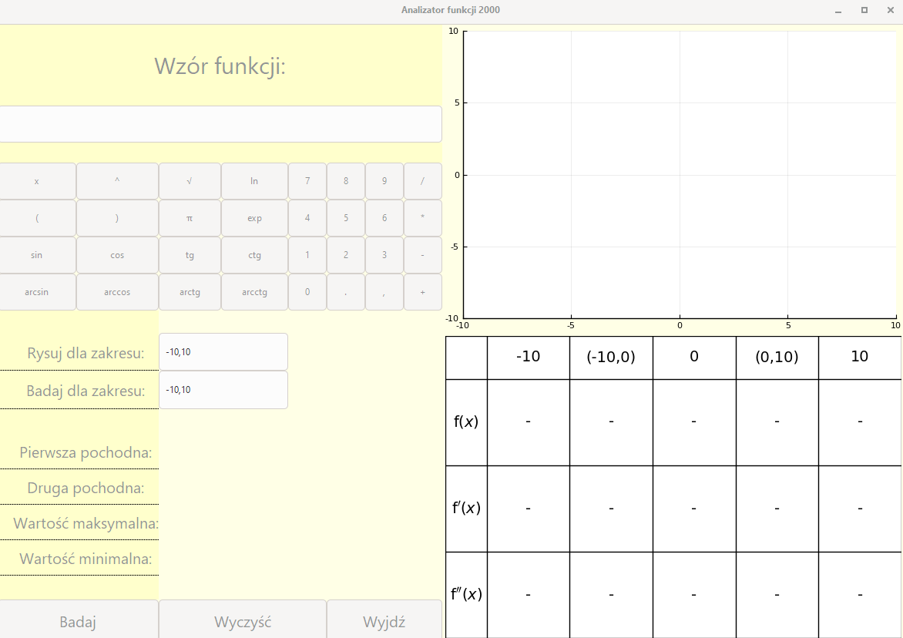
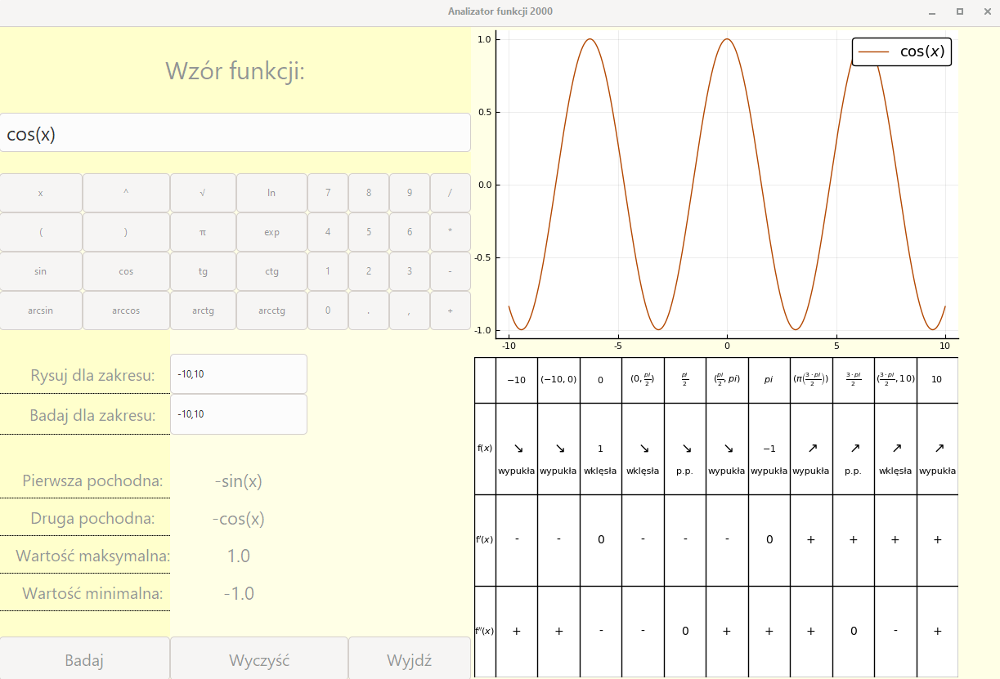

# analizator_funkcji

Pakiety matematyczne 2019/20
Projekt Julia: Analizator funkcji 2000

Pliki:

1) Projekt_funkcje.jl - zawiera funkcje opakowane w moduł Func,
2) Projekt_GUI.jl - plik uruchamiający program, zawiera Gui, 
3) style.css - plik modyfikujący wygląd programu.

Użyte biblioteki: 

Gtk, SymPy, Plots, Latexify, LaTeXStrings

Spospób uruchomienia:

Skompilować plik Projekt_Funkcje.jl a następnie Projekt_GUI.jl.

Enjoy! ;)

